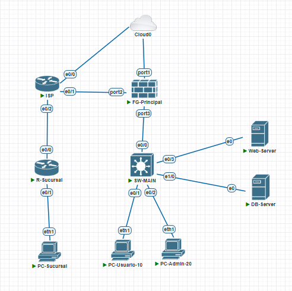
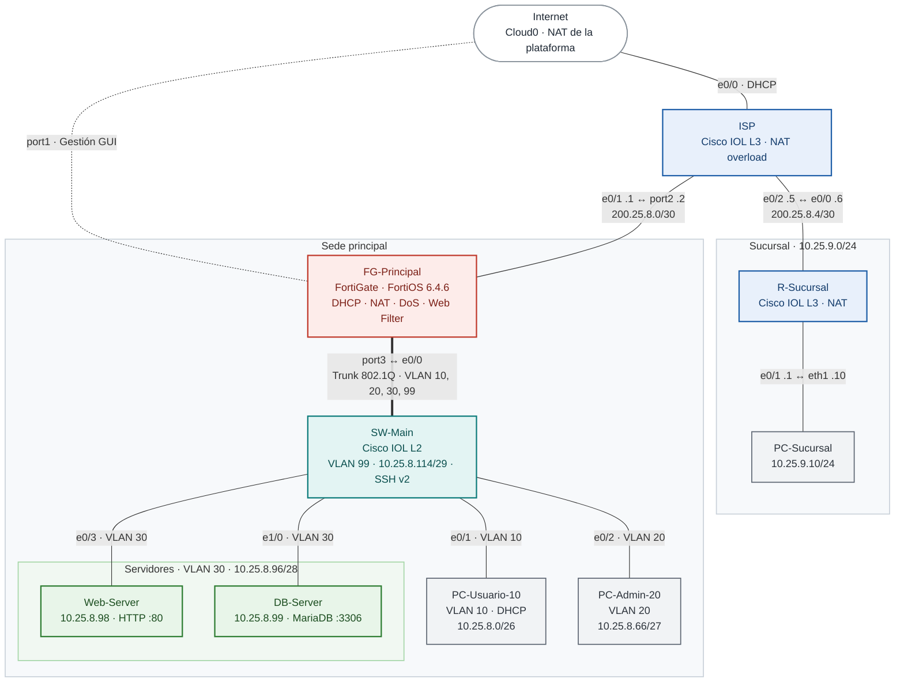

# Práctica P# — Seguridad perimetral con FortiGate

**Estudiante:** <Nombre Apellido> &nbsp;|&nbsp; **Matrícula:** 2025-0800 &nbsp;|&nbsp; **Institución:** Instituto Tecnológico de Las Américas (ITLA)

> 🎥 **Video de demostración:** [<https://youtu.be/XXXXXXXXXXX>](https://youtu.be/2fjnMXQRM4s)

---

## Contenido

1. [Propósito](#1-propósito)
2. [Matriz de cumplimiento](#2-matriz-de-cumplimiento)
3. [Topología](#3-topología)
4. [Direccionamiento](#4-direccionamiento)
5. [Implementación y evidencias](#5-implementación-y-evidencias)
6. [Resumen de políticas del FortiGate](#6-resumen-de-políticas-del-fortigate)
7. [Archivos de configuración](#7-archivos-de-configuración)
8. [Estructura del repositorio](#8-estructura-del-repositorio)

---

## 1. Propósito

Este proyecto implementa una red empresarial protegida por un firewall FortiGate, emulada en PNETLab. La solución:

- Segmenta usuarios, usuarios administrativos, servidores y gestión mediante VLANs y un trunk 802.1Q.
- Proporciona salida controlada a Internet a través de un ISP con NAT.
- Restringe la navegación de los servidores exclusivamente a los repositorios oficiales de actualización de Ubuntu.
- Protege la VLAN de usuarios frente a ataques de denegación de servicio por SYN flood.
- Aplica filtrado web sobre una sección específica del servidor web, mostrando al usuario la página de violación de política.

Toda la configuración y la demostración del FortiGate se realizaron mediante su interfaz gráfica (GUI).

## 2. Matriz de cumplimiento

| # | Requisito | Implementación | Evidencia |
|---|---|---|---|
| 1 | Direccionamiento y VLANs | VLAN 10 (DHCP), VLAN 20, servidores en /28, trunk 802.1Q, hostnames | [5.1](#51-direccionamiento-y-vlans) |
| 2 | VLAN administrativa y SSH | VLAN 99, SSH v2, Telnet deshabilitado | [5.2](#52-vlan-administrativa-y-acceso-ssh) |
| 3 | Salida a Internet | Ruta por defecto y NAT en el FortiGate | [5.3](#53-salida-a-internet) |
| 4 | Servidores | HTTP en Web-Server, MariaDB en 3306 | [5.4](#54-servidores) |
| 5 | Servidores sin Internet abierto | Objetos FQDN, solo HTTP/HTTPS hacia los repositorios | [5.5](#55-servidores-sin-acceso-abierto-a-internet) |
| 6 | Repositorio de GitHub | README, configuraciones e imágenes | [7](#7-archivos-de-configuración) · [8](#8-estructura-del-repositorio) |
| 7 | Protección DoS | Política DoS con `tcp_syn_flood` en VLAN 10 | [5.6](#56-protección-contra-dos-rate-limiting) |
| 8 | Página de violación de política | Web Filter sobre `/inventario` | [5.7](#57-página-de-violación-de-política) |

## 3. Topología






### 3.1 Equipos

| Equipo | Función | Plataforma |
|---|---|---|
| FG-Principal | Firewall perimetral, gateway inter-VLAN, DHCP, DNS y NAT | FortiGate-VM64-KVM — FortiOS 6.4.6 |
| SW-Main | Switch de acceso y trunk 802.1Q | Cisco IOL L2 — IOS 15.2 |
| ISP | Proveedor de Internet con NAT hacia la nube de la plataforma | Cisco IOL L3 — IOS 15.4 |
| R-Sucursal | Router de la sucursal | Cisco IOL L3 — IOS 15.4 |
| PC-Usuario-10 | Usuario de la VLAN 10 | Ubuntu (Docker) |
| PC-Admin-20 | Usuario administrativo de la VLAN 20 | Ubuntu (Docker) |
| PC-Sucursal | Usuario de la sucursal | Ubuntu (Docker) |
| Web-Server | Servidor HTTP (Python 3 `http.server`) | Ubuntu Server 20.04 |
| DB-Server | Servidor de base de datos MariaDB | Ubuntu Server 20.04 |

### 3.2 Interconexiones

| Origen | Destino | Descripción |
|---|---|---|
| FG-Principal `port1` | Cloud0 | Gestión (acceso a la GUI) |
| FG-Principal `port2` | ISP `e0/1` | Enlace WAN |
| FG-Principal `port3` | SW-Main `e0/0` | Trunk 802.1Q (VLAN 10, 20, 30, 99) |
| ISP `e0/0` | Cloud0 | Salida a Internet |
| ISP `e0/2` | R-Sucursal `e0/0` | Enlace WAN de la sucursal |
| R-Sucursal `e0/1` | PC-Sucursal | LAN de la sucursal |
| SW-Main `e0/1` | PC-Usuario-10 | Access VLAN 10 |
| SW-Main `e0/2` | PC-Admin-20 | Access VLAN 20 |
| SW-Main `e0/3` | Web-Server | Access VLAN 30 |
| SW-Main `e1/0` | DB-Server | Access VLAN 30 |

## 4. Direccionamiento

El direccionamiento se basa en la matrícula **2025-0800**: red interna `10.25.8.0` (25 = 2025, 8 = 0800) y segmento público `200.25.8.0`.

| Segmento | VLAN | Red | Gateway | Asignación |
|---|---|---|---|---|
| Usuarios | 10 | 10.25.8.0/26 | 10.25.8.1 | DHCP (10.25.8.10 – 10.25.8.60) |
| Usuarios administrativos | 20 | 10.25.8.64/27 | 10.25.8.65 | PC-Admin-20: 10.25.8.66 |
| Servidores | 30 | 10.25.8.96/28 | 10.25.8.97 | Web-Server: 10.25.8.98 · DB-Server: 10.25.8.99 |
| Gestión del switch | 99 | 10.25.8.112/29 | 10.25.8.113 | SW-Main: 10.25.8.114 |
| WAN FortiGate – ISP | — | 200.25.8.0/30 | — | ISP: .1 · FortiGate: .2 |
| WAN Sucursal – ISP | — | 200.25.8.4/30 | — | ISP: .5 · R-Sucursal: .6 |
| LAN Sucursal | — | 10.25.9.0/24 | 10.25.9.1 | PC-Sucursal: 10.25.9.10 |

## 5. Implementación y evidencias

### 5.1 Direccionamiento y VLANs

- VLANs creadas en SW-Main: **10** (USUARIOS), **20** (ADMINISTRATIVOS), **30** (SERVIDORES) y **99** (GESTION).
- Trunk 802.1Q en `e0/0` hacia el FortiGate, limitado a las VLANs 10, 20, 30 y 99.
- Subinterfaces VLAN sobre `port3` del FortiGate, que actúa como gateway de cada segmento.
- Servidor DHCP del FortiGate en la VLAN 10, que entrega IP, gateway y DNS a los usuarios.
- Hostname configurado en todos los equipos de la topología.


> La asignación de IP por DHCP en la VLAN 10 se observa en la evidencia de la sección [5.3](#53-salida-a-internet).

### 5.2 VLAN administrativa y acceso SSH

- Interfaz de gestión `Vlan99` con IP **10.25.8.114/29** y ruta por defecto hacia el FortiGate (10.25.8.113).
- Autenticación con usuario local, llaves RSA de 2048 bits y **SSH versión 2**.
- Líneas VTY restringidas con `transport input ssh`, lo que deshabilita Telnet.
- La política *VLAN10-SSH-Switch* permite SSH y Telnet hacia el switch, de modo que el rechazo de Telnet proviene del propio switch y no del firewall.


### 5.3 Salida a Internet

- Ruta por defecto en el FortiGate hacia el ISP (`200.25.8.1` por `port2`).
- Política *VLAN10-Internet* con NAT sobre la dirección de salida `200.25.8.2`.
- El ISP aplica NAT overload hacia la nube de la plataforma para la salida real a Internet.
- La sucursal (R-Sucursal) tiene ruta por defecto hacia el ISP y NAT propio para su LAN.


### 5.4 Servidores

| Servidor | IP | Servicio | Puerto |
|---|---|---|---|
| Web-Server | 10.25.8.98 | HTTP (Python 3 `http.server`), publica `/` y `/inventario` | TCP 80 |
| DB-Server | 10.25.8.99 | MariaDB, escuchando en todas las interfaces | TCP 3306 |


### 5.5 Servidores sin acceso abierto a Internet

- Objetos FQDN `archive.ubuntu.com` y `security.ubuntu.com`, agrupados en `GRP-UBUNTU-UPDATES`.
- Política *Servidores-Updates*: VLAN 30 → WAN, únicamente **HTTP/HTTPS** hacia el grupo FQDN, con NAT.
- Servicio DNS del FortiGate en la VLAN 30 en modo *Forward to System DNS*, de forma que los servidores resuelven nombres sin necesitar salida DNS a Internet.
- Repositorios de los servidores apuntando exclusivamente a `archive.ubuntu.com` y `security.ubuntu.com`.
- Cualquier otro destino cae en el *Implicit Deny*, que tiene habilitado el registro del tráfico denegado.


### 5.6 Protección contra DoS (rate limiting)

- Política IPv4 DoS **DoS-VLAN10**, aplicada a la interfaz de entrada VLAN 10.
- Anomalía `tcp_syn_flood` con un umbral de **100 SYN/s**, acción **Block** y registro habilitado.
- Prueba desde PC-Usuario-10 contra el Web-Server:

```bash
  hping3 -S -p 80 -i u5000 10.25.8.98
```

  Con este comando se envían ≈200 SYN/s, por encima del umbral configurado.


### 5.7 Página de violación de política

- Perfil Web Filter **WF-Inventario** (flow-based) con un filtro de URL estático `10.25.8.98/inventario*` en acción **Block**.
- Perfil aplicado a la política *VLAN10-WebServer* (VLAN 10 → Web-Server, HTTP).
- El resto del sitio permanece accesible; al solicitar `/inventario`, el FortiGate entrega su página de violación de política.


## 6. Resumen de políticas del FortiGate

### 6.1 Políticas de firewall

| ID | Nombre | Origen | Destino | Servicios | NAT | Perfil de seguridad |
|---|---|---|---|---|---|---|
| 1 | VLAN10-Internet | VLAN10 · 10.25.8.0/26 | port2 · all | ALL | ✔ | — |
| 2 | VLAN10-SSH-Switch | VLAN10 · 10.25.8.0/26 | VLAN99 · 10.25.8.114 | SSH, TELNET | ✖ | — |
| 3 | Servidores-Updates | VLAN30 · 10.25.8.96/28 | port2 · GRP-UBUNTU-UPDATES | HTTP, HTTPS | ✔ | — |
| 4 | VLAN10-WebServer | VLAN10 · 10.25.8.0/26 | VLAN30 · 10.25.8.98 | HTTP, PING | ✖ | WF-Inventario |
| 0 | Implicit Deny | any | any | ALL | — | Registro habilitado |

### 6.2 Política DoS

| Nombre | Interfaz | Anomalía | Umbral | Acción |
|---|---|---|---|---|
| DoS-VLAN10 | VLAN10 | `tcp_syn_flood` | 100 | Block + log |

## 7. Archivos de configuración

| Equipo | Archivo |
|---|---|
| FG-Principal | [`configs/FG-Principal.conf`](configs/FG-Principal.conf) |
| SW-Main | [`configs/SW-Main.txt`](configs/SW-Main.txt) |
| ISP | [`configs/ISP.txt`](configs/ISP.txt) |
| R-Sucursal | [`configs/R-Sucursal.txt`](configs/R-Sucursal.txt) |

## 8. Estructura del repositorio

```text
.
├── README.md
├── configs/
│   ├── FG-Principal.conf
│   ├── SW-Main.txt
│   ├── ISP.txt
│   └── R-Sucursal.txt
└── imagenes/
    ├── 00-topologia.png
    ├── 01-vlans-trunk.png
    ├── 02-dhcp-internet.png
    ├── 03-ruta-default.png
    ├── 04-politicas.png
    ├── 05-ssh-telnet.png
    ├── 06-servidores-servicios.png
    ├── 07-servidores-update-bloqueo.png
    ├── 08-log-implicit-deny.png
    ├── 09-dos-politica.png
    ├── 10-dos-log.png
    ├── 11-webfilter-pagina.png
    └── 12-webfilter-log.png
